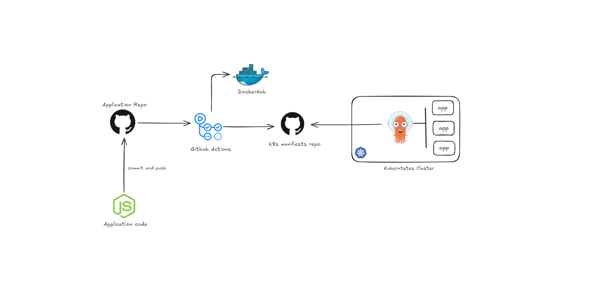

# CI/CD Pipeline for Node.js Application using Github Actions and ArgoCD

### Overview

This project demonstrates setting up a CI/CD pipeline for a Node.js application. The pipeline test the application code,builds a Docker image of the application, pushes it to Docker Hub, and then deploys it in kubernetes environment (local) via argocd.


### Pre-requisites

1. Running Kubernetes cluster (minikube, kind, k3s, etc.)
2. ArgoCD installed in the cluster.
3. Docker Hub account.
4. Secrets setup in the repository for Docker Hub credentials.
5. PAT (Personal Access Token) for the repository where kubernetes manifest files are stored with write access.


### Repository Structure

```
.github/
  workflows/
    github-actions-demo.yml
.gitignore
app.test.js
app.js
compose.yaml
Dockerfile
package.json
readme.md
```

### Files and Directories

* **.github/workflows/github-actions-demo.yml**: GitHub Actions workflow file that defines the CI/CD pipeline.

* **.gitignore**: Specifies files and directories to be ignored by Git.
* **app.js**: Main application file for the Node.js Express app.
* **compose.yaml**: Docker Compose file used to deploy the application on the EC2 server. (Not used in this project)
*  **Dockerfile**: Dockerfile to build the Docker image for the Node.js application.
* **package.json**: Contains metadata about the project and its dependencies.
* **readme.md**: Project documentation.

### Application Code

The application code is a simple Node.js Express app that listens on port 3000 and responds with a "Hello, World!" message.


```
const express = require('express');

const app = express();

app.get('/', (req, res) => {
    res.send('Updated Hello, World! from container!❤️');
});

app.listen(3000, () => {
    console.log('Server is running on port 3000');
});
```


### Dockerfile
The Dockerfile is used to build the Docker image for the application:

```
# Use the official Node.js 14 image as the base image
FROM node:14-alpine

# Set the working directory in the container
WORKDIR /app

# Copy package.json and package-lock.json to the working directory
COPY package*.json ./

# Install the dependencies
RUN npm install

# Copy the rest of the application code to the working directory
COPY . .

# Expose the port on which the application will run
EXPOSE 3000

# Start the application
CMD [ "npm", "start" ]
```

### Docker Compose

The `compose.yaml` file defines the services that make up the application:

***Q. Why this instead of directly using docker command to run the container on the server?***

Ans - To avoid port conflicts and to manage multiple containers easily.

```
version: "3"
services:
  app:
    image: ${REPO_NAME}:${TAG}
    ports:
      - "3000:3000"
    container_name: my-app
```

### CI/CD Pipeline

The CI/CD pipeline is defined in the `github-actions-demo.yml` file. The pipeline consists of the following steps:


#### Workflow



#### Build Job
1. **Checkout code**: Uses actions/checkout@v2 to checkout the repository.
2. **Get commit SHA**: Extracts the commit SHA.
3. **Set output**: Sets the commit SHA as an output variable.
4. **Build Docker Image**: Builds the Docker image.
5. **Login to Docker Hub**: Logs into Docker Hub using secrets.
6. **Push image to Docker Hub**: Pushes the Docker image to Docker Hub.


<!-- #### Deploy Job // only used when deploying on EC2
1. **Checkout code**: Uses actions/checkout@v2 to checkout the repository.
2. **Set up SSH config**: Configures SSH.
Copy SSH key: Copies the SSH key.
3. **List files**: Lists files in the working directory.
4. **Copy compose.yaml to EC2**: Copies the compose.yaml file to the EC2 server.
5. **SSH into EC2 and Deploy**: SSHs into the EC2 server and deploys the application using Docker Compose. -->


#### Deploy Job
1. **Checkout code**: Uses actions/checkout@v2 to checkout the repository.
2. We need to update the image tag in the manifest file which is stored on other repository.
3. Setup personal access token for the 'other' repository.
4. Checkout the 'other' repository where kubernetes manifest files are stored.
5. Update the image tag in the manifest file.
6. Commit the changes.
7. Push the changes to the repository.


### Post Push to Repository
When the change to the manifest file is pushed to the repository, ArgoCD running in kubernetes cluster will automatically pull the changes and update the deployment.

### Secrets

These secrets need to be added to the repository settings:

```
DOCKER_USERNAME: ${{ secrets.DOCKER_USERNAME }}
DOCKER_PASSWORD: ${{ secrets.DOCKER_PASSWORD }}
PAT: ${{ secrets.PAT }} // for the repository where kubernetes manifest files are stored.
```


### Running the Application

To run the application locally:

1. Install dependencies:

    ```
    npm install
    ```

2. Start the application:

    ```
    npm start
    ```

3. Access the application at `http://localhost:3000`.

### Conclusion

This project sets up a CI/CD pipeline to automate the build, push, and deployment of a Node.js Express application using Docker and GitHub Actions. The pipeline ensures that the application is always up-to-date and running on k8s.